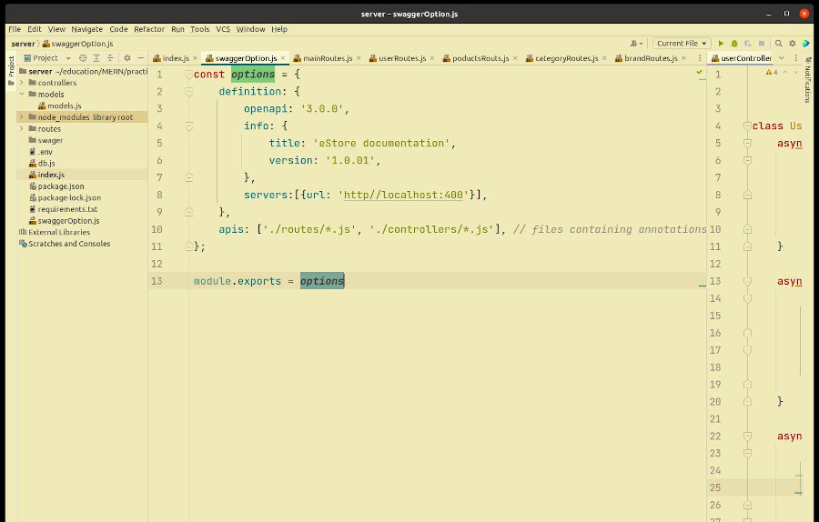
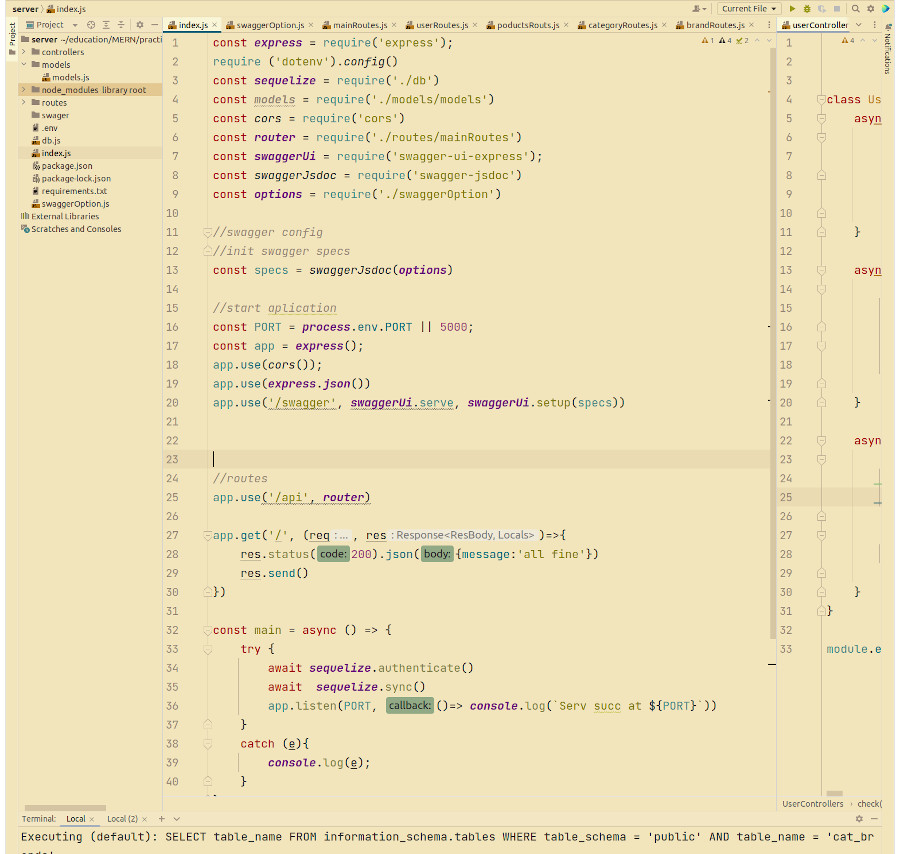

[import create reaxt app](http://mysite.com/)

## Документация в проекте.
О необходимости использования документации при написании приложений написана не одна статья.
итак в принципе зачем нам нужна документация в приложениях??
Казалось бы да ответ очевиден она в первую очередь, **документация** **помогает** **нам** **самим** **разобраться** **в** **том** **коде**, **который** **мы**
**писали** **в** **прошлом**. 

Казалось бы мы ведь, его (код) сами написали, стало быть мы ~~четко знали~~, что делаем и тем не менее, в силу динамики современного мира и насыщенности
информационного потока, в силу огромного количества кодовой базы, через неделю мы можем уже забыть 
что, мы делали. Кроме того, если мы ведем совместную работу, то без документации не обойтись, наш коллега должен видеть и понимать
что мы делаем, или что мы сделали. Также, документация существенно повышает отлов ошибок, тестируемость кода. 
Весьма и весьма, полезна документация будет при разработке классического RESTful сервера, для документирования
endpoint - ов.

## Варианты.
На данный момент, наиболее, удобный - "документатор" на сегодняшний день, думаю swagger. Он позволяет вести 
документацию кода, а также выполнять первичное тестирование за счет встроенного языка Yaml, но об этом позже. 

Для примера, я буду использовать nodejs и покажу в этом документе, как развернуть swagger в вашем приложении в частности, покажу примеры 
использования для описания документации, при создании представлении и контроллеров CRUD для бекенда интернет магазина. 

## Использование.
Итак, процесс установки и создания REST сервера с применением MVC паттернов выходит за рамки этой статьи. Надеюсь, читатель сам знает, как
это сделать, поэтому этот момент я опущу, и лишь скажу что данный метод будет работать во всех операционных системах, сам я использую **Ubuntu** **20.04**.
* Итак, предположим что у нас имеется некий сервер написанный с использованием **node** и **express**
* У нас есть, какая-то БД которая хранит наши данные;
* У нас есть, какие-то модели которые описывают наши модели и их отношения; 
* У нас есть какие-то routes(маршруты), имеющие вид CRUD; 
* У нас есть какая-то папка для создания наших классов контроллеров.

## Установка
И так установим для нашего проекта [swagger-Jsdoc](https://www.npmjs.com/package/swagger-jsdoc) и [swagger-ui-express](https://www.npmjs.com/package/swagger-ui-express)

### `npm i swagger-ui-express  swagger-jsdoc`

Теперь добавим **swagger** в проект: 

### `const swaggerUi = require('swagger-ui-express');`

### `const swaggerJsdoc = require('swagger-jsdoc')`

Отлично, мы стали на шаг универсальнее! Теперь создадим конфигурационный файл и сконфигурируем наш сервер, будем использовать наш сервер разработки.
Создадим файл **swaggerOptions.js**

Добавим конфигурацию для сервера:
данная конфигурация не является исчерпывающей, с другими примерами можно ознакомится на [swagger-Jsdoc](https://www.npmjs.com/package/swagger-jsdoc)

### Пример конфигурации  
     const options = {
        definition: {
            openapi: '3.0.0',
            info: {
                title: 'eStore documentation',
                version: '1.0.01',
            },
            servers:[{url: 'http//localhost:4000'}],
        },
        apis: ['./routes/*.js'], 
     };

     module.exports = options

Тут мы используем json объект - options в коде инициализируется документация swagger ***openapi 3.0.0***, 
в поле title и version, будут отображатся в вашем сервере. В поле ***apis*** также идет прямое указание 
какая папка будет доступна для сбора документации swagger, объект экспортируется для использования в основной конфигурации 
сервера.

Импортируем наш объект в server: 
### `const options = require('./swaggerOption');`

Создаем спцификацию:
### `const specs = swaggerJsdoc(options)`

***Инициализируем express:***

### `const app = express();`

***Запускаем сервер с документатором:***

### `app.use('/swagger', swaggerUi.serve, swaggerUi.setup(specs))`

***сервер будет запущен по адресу [swagger](http://localhost:4000/swagger/)*** 

На изображении показан пример инициализации сервера 

### Синтаксис и работа с сервером swagger.

