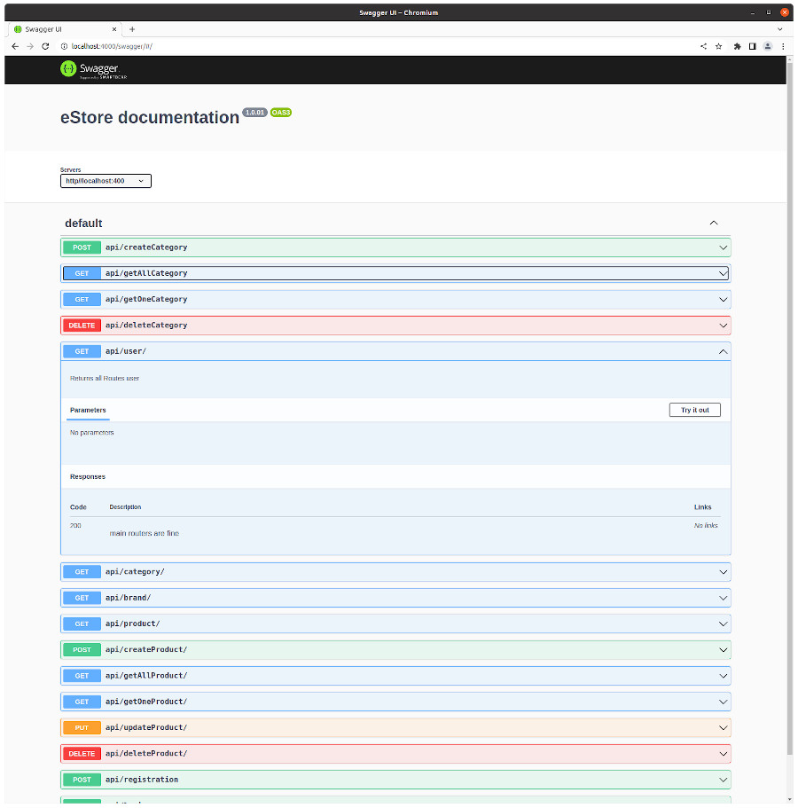

# MarkDown instruction

## Выделение текста
Чтобы выделить текст курсивом, необходимо обрамить его звездочками (*) или знаком нижнего подчеркиванием
(_), Например так *акуац*, _пеукпе_

Чтобы выделить текст полужирным, необходимо обрамить его двойными (**) **пкпе** или (__) __пеукпе__
Альтернатива создана для того чтобы можно совмещать  два этих способа

Например, _акцуацу_ и полужирным **руре**

## Списки

## Работа с изображениями

Чтобы вставить изображение в текст достаточно написать 

## Ссылки

## Работа с таблицами 

## Цитаты

## Заключение

