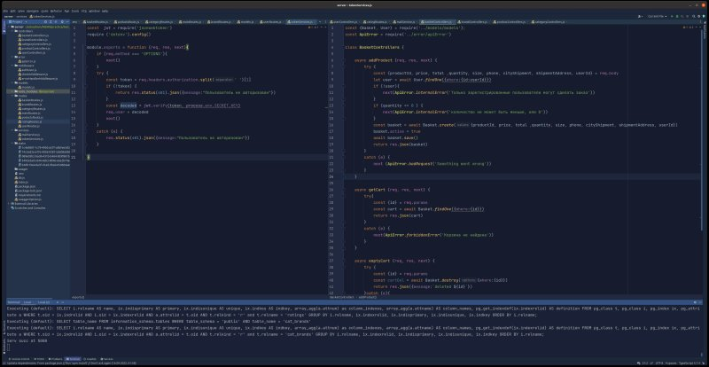

# MarkDown instruction

## Выделение текста
Чтобы выделить текст курсивом, необходимо обрамить его звездочками (*) или знаком нижнего подчеркиванием
(_), Например так *акуац*, _пеукпе_

Чтобы выделить текст полужирным, необходимо обрамить его двойными (**) **пкпе** или (__) __пеукпе__
Альтернатива создана для того чтобы можно совмещать  два этих способа

Например, _акцуацу_ и полужирным **руре**

## Списки

Чтобы выделить  нумерованный список, используем (*)

Ненемерованные списки добавляются с помощью звездочки (*)

* Элем 1
* Элем 2
* Элем 3

Нумерованные списки добавляются нумерацией%

1. Элем
2. Элем

## Работа с изображениями

Чтобы вставить изображение в текст достаточно написать 

## Ссылки
Для работы с аутентификацией пользователй будем использовать **jsonwebtoken и bcrypt**

Установим для нашего проекта [jsonwebtoken](https://www.npmjs.com/package/jsonwebtoken) и [bcrypt](https://www.npmjs.com/package/bcrypt)

Для отправки почты пользователям используем **nodemailer**

Установим для нашего проекта [nodemailer](https://www.npmjs.com/package/nodemailer)

## Работа с таблицами 

## Цитаты
Тут приведен код mailService.js, который позволяет при помощи модуля nodemailer, отправлять письма с линком
активации, пользователям при их регистрации в web-application

        const nodemailer = require('nodemailer')
        require ('dotenv').config()
        
        class MailService {
            constructor() {
                this.transporter = nodemailer.createTransport({
                host:process.env.SMTP_HOST,
                port: process.env.SMTP_PORT,
                secure: false,
                auth: {
                    user: process.env.SMTP_USER,
                    pass: process.env.SMTP_PASS,
                      }
                })
            }
    
            async sendActivationMail(to, link){
                await this.transporter.sendMail({
                    from: process.env.SMTP_USER,
                    to,
                    subject: "Активация аккаунта на"+ process.env.API_URL,
                    text: '',
                    html: `
                            

                            <h1> Для активации перейдите по ссылке</h1>
                            <a href="${link}">${link}</a>                
                            
                
                    `
                })
            }
        }

        module.exports = new MailService()

Имя ссылки генерируется при помощи uuid. В конце, мы экспортируем этот модуль, что позволяет сделать, этот
код - переиспользуемым компонентом 

## Заключение
Тут будет заключение

